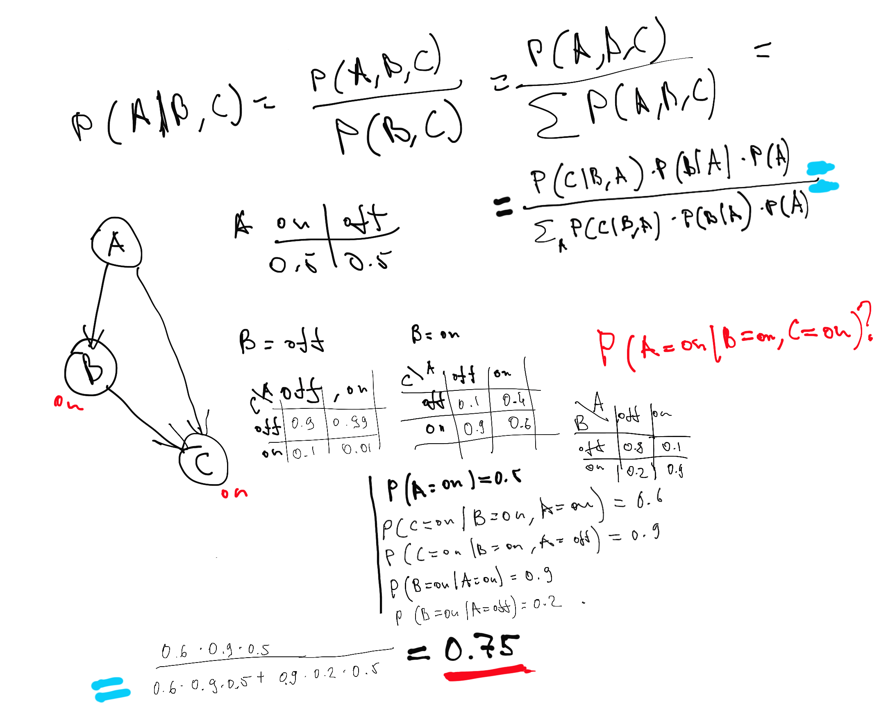
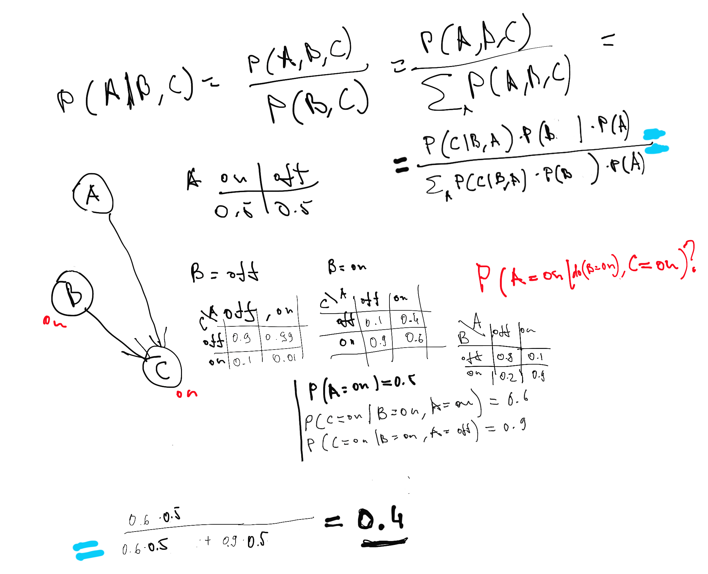

```{r setup, include=FALSE}
knitr::opts_chunk$set(echo = TRUE)
library(bnlearn)
library(dplyr)
```


```{r net}
netStr <- "[A][S][E|A:S][O|E][R|E][T|O:R]"
net <- model2network(netStr)
d_sep <- bnlearn:::dseparation
d_sep(bn = net, x = 'A', y = 'E', z = c('R', 'T'))
```

```{r bruteforce}
vars <- nodes(net)
pairs <- combn(x = vars, 2, list)
arg_sets <- list()
for(pair in pairs) {
  others <- setdiff(vars, pair)
  conditioning_sets <- unlist(lapply(0:4, function(.x) combn(others, .x, list)), recursive = F)
  for(set in conditioning_sets) {
    args <- list(x = pair[1], y = pair[2], z = set)
    arg_sets <- c(arg_sets, list(args))
  }
}
```

## Question 1: D-separation and global Markov property assumption

### 1.a True d-separation statements (4 points)
Create a new list. Iterate through the list of argument sets and evaluate if the d-separation statement is true. If a statement is true, add it to the list.  Show code.  Print an element from the list and write out the d-separation statement in English. 

```{r all d-separations}
d_seps <- list()
for (arg_set in arg_sets) {
    if (d_sep(bn=net, x=arg_set$x, y=arg_set$y, z=arg_set$z)) {
      d_seps <- c(d_seps, list(arg_set))
    }
}
for (ds in d_seps) {
  ## “A is d-separated from E by R and T”.
  cat(ds$x, "is d-separated from", ds$y,  "by", ds$z, "\n")
}
```

### 1.b Redundant d-separation statements (3 points)

Given two d-separation statements A and B, if A implies B, then we can say B is a redundant statement. This list is going to have some redundant statements. Print out an example of two elements in the list, where one one element implies other element.  Write both of them out as d-separation statements, and explain the redundancy in plain English. 

Two redundant statements are:
```                             
X: "A is d-separated from O by E"
Y: "A is d-separated from O by E R"
```

Statement X implies statement Y because:
                                    
  a. they are different only by  set of conditioning sets and
  b. conditioning sets in statement X is subset of conditioning set in statement Y and
  c. "extra" variables in conditioning set in statement Y {R} = {E, R}-{E} is not collider, i.e.
   adding non-collider to conditioning set should not change d-separation statement


### 1.c Improve the brute-force algorithm for finding true d-separation statements (1 point)

Based on this understanding of redundancy, how could this algorithm for finding true d-separation statements be made more efficient?
[skipped]


### 1.d Conditional independence test on true d-separation statements (4 points)

A joint distribution ${P_{\mathbb{X}}}$ is said to satisfy **global Markov property** with respect to DAG ${\mathbb{G}}$ if $A \perp_{\mathbb{G}}B|C \Rightarrow  A \perp_{P_{\mathbb{X}} }B|C$ for all disjoint vertex sets A, B, C. In other words, every true d-separation statement in the DAG corresponds to a true conditional independence statement in the joint probability distribution.  We don't know the true underlying joint probability distribution that generated this data, but we do have the data.  That means we can do statistical tests for conditional independence, and use some quick and dirty statistical decision theory to decide whether a conditional independence statement is true or false.

The `ci.test` function in `bnlearn` does statistical tests for conditional independence.  The null hypothesis in this test is that the conditional independence is true.  So our decision critera is going to be:

> If p value is below a .05 significance threshold, conclude that the conditional independence statement is false  Otherwise conclude it is true.

```{r}
.data <- read.table("survey.txt", header = TRUE)
.data[] <- lapply(.data, function(x) as.factor(x))

test_outcome <- ci.test('T', 'E', c('O', 'R'), .data)
print(test_outcome)
print(test_outcome$p.value)
alpha <- .05
print(test_outcome$p.value > alpha)
```

Evaluate the global Markov property assumption by doing a conditional independence test for each true d-separation statement. Print any test results where the p-value is not greater than .05.

```{r}
for (ds in d_seps) {
  p_test <- ci.test(ds$x, ds$y, ds$z, .data)
  if (p_test$p.value <= 0.05) {
    cat(ds$x, "is d-separated from", ds$y,  "by", ds$z, "p-value, however", p_test$p.value, "\n")
  }
}
```

### 1.e Conditional independest test and non-redundant d-separation statements (1 point plus 2 points extra credit)

What is apparent about these these printed statements with respect to whether or not the statement is redundant?

Answer: Printed statements are all redundant.

## Question 2: Faithfulness assumption

### 2.a True conditional independence statements (4 points)

A joint distribution $P_{\mathbb{X}}$ is **faithful** to DAG ${\mathbb{G}}$ if $A \perp_{P_{\mathbb{X}}}B|C \Rightarrow  A \perp_{\mathbb{G} }B|C$ for all disjoint vertex set A, B, C. In other words, every true conditional independence statement about the joint distribution corresponds to a true d-separation statement in the DAG  Iterate through the `arg_sets` list again, run the conditional independence test for each argument set, creating a new list of sets where you conclude the conditional independence statement is true.


```{r}
d_separation_statements <- list()
condition_independence_statements <- list()
both_indpendent_and_d_separated_counter <- 0
for (arg_set in arg_sets) {
    d_separated <- FALSE
    conditionally_independent <- FALSE

    if (d_sep(bn=net, x=arg_set$x, y=arg_set$y, z=arg_set$z)) {
      d_separated <- TRUE
      d_separation_statements <- c(d_separation_statements, list(arg_set))
    }

  p_test <- ci.test(arg_set$x, arg_set$y, arg_set$z, .data)
  if (p_test$p.value > 0.05) {
     conditionally_independent <- TRUE
     condition_independence_statements <- c(condition_independence_statements, list(arg_set))
  }
  if (conditionally_independent && d_separated) {
    both_indpendent_and_d_separated_counter <- both_indpendent_and_d_separated_counter + 1
  }
}
```

### 2.b True conditional inpdendence statements among true d-separation statements (1 point)

Combine that analysis with the analysis from previous questions. What is the proportion of true D-separation statements that are also true conditional independence statements?

```{r proportion-of-d-sep-statements}
cat("The proportion of true D-separation statements that are also true conditional independence statements", both_indpendent_and_d_separated_counter/length(d_separation_statements))
```

### 2.c True d-separation statements among true conditional inpdendence statements (1 point)

What is the proportion of true conditional independence statements that are also true-d-separation statements?

```{r proportion-of-cond-ind-statements}
cat("The proportion of true conditional independence statements that are also true-d-separation statements", both_indpendent_and_d_separated_counter/length(condition_independence_statements))
```

### 2.d Results of non-redundant d-separation statements (1 point)

How would these results change if we only considered non-redundant d-separation statements?

Answer: Since some redundant d-separation statements do not satisfy conditional independence test therefore
if they were eliminated the ratio:
```{r}
both_indpendent_and_d_separated_counter/length(d_separation_statements)
```
would be higher than one calculated above (i.e > 0.918). Similarly 

### 2.e Conclusion (1 point)

Based on these results, how well do the faithfulness assumption and global Markov property assumption hold up with this DAG and dataset?

Answer: Global Markov property holds well, since d-separation
matches conditional independences staments in about 91% cases (probably more if redundant statemts are eliminated)
while faithfulness does not hold since conditionally indepence statements matching to d-separation staements only in 33% cases.

## Question 3: Interventions as graph mutilation
```{r}
net <- model2network('[A][B|A][C|B:A]')
nombres <- c('off', 'on')
cptA <- matrix(c(0.5, 0.5), ncol=2)
dimnames(cptA) <- list(NULL, nombres)
cptB <- matrix(c(.8, .2, .1, .9), ncol=2)
dimnames(cptB) <- list(B = nombres, A = nombres)
cptC <- matrix(c(.9, .1, .99, .01, .1, .9, .4, .6))
dim(cptC) <- c(2, 2, 2)
dimnames(cptC) <-  list(C = nombres, A = nombres, B = nombres)
model <- custom.fit(net, list(A = cptA, B = cptB, C = cptC))
graphviz.plot(model)
```

### 3.a (3 points)

Q: Given this model, use Baye's rule to calculate by hand $P(A = \text{on} \ | \ B = \text{on}, C = \text{on})$.  Show work.
A:
    
#### Calculations:
    


### 3.b (3 points)

Estimate this probability using a *rejection sampling inference algorithm*.  

#### Rejection sampling inference:

```{r simulations}
sim = rbn(model, 1000000)
filtered_on_B_on_C_on = filter(sim, B == 'on') %>% filter(C == 'on')
dim(filter(filtered_on_B_on_C_on, A == 'on'))[1]/dim(filtered_on_B_on_C_on)[1]
```

### 3.c (1 point)

Use `mutilated` to create a new graph under the intervention $\text{do}(B = on)$.  Plot the new graph.

```{r mutilated_model}
mutilated_model = mutilated(model, evidence = list(B = 'on'))
graphviz.plot(mutilated_model)
```

### 3.d (3 points)

As in problem 3.1, use Baye's rule to calculate by hand $P(A = on\ | \  \text{do}(B = on), C = on)$.  Show work.

#### 


### 3.e (2 points)

Use the rejection sampling inference procedure you used to estimate $P(A = on\ | \  B = on, C = on)$ to now estimate $P(A = on\ | \  \text{do}(B = on), C = on)$.  
```{r simulations-mutilated}
m_sim = rbn(mutilated_model, 1000000)
m_filtered_on_B_on_C_on = filter(m_sim, B == 'on') %>% filter(C == 'on')
dim(filter(m_filtered_on_B_on_C_on, A == 'on'))[1]/dim(m_filtered_on_B_on_C_on)[1]
```
