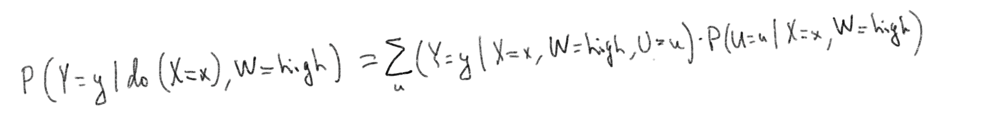

```{r setup, include=FALSE}
knitr::opts_chunk$set(echo = TRUE)
library(bnlearn)
library(dplyr)
```


The following DAG represents a causal model of user behavior in an app.

```{r, collider_adjustment_ex1, echo=F, warning=F, message=F, out.width = "100px"}
library(bnlearn, quietly = T, warn.conflicts = F)
dag <- model2network("[U][X][Y|U:X][W|U:X]")
graphviz.plot(dag)
```

U represents the user specific preferences.  X represents the introduction of a feature designed to make users make certain in-app purchases, Y was whether or not the user made the purchase, W represents app usage after the feature is introduced.

### 1.1.a 
You are interested in estimating the causal effect of X on Y.  List all the valid adjustment sets. A valid adjustment set is the set of variables that if you adjust, you will get the unbiased results. (For a formal definition of valid adjustment set, see "ELements of Causal Inference", Definition 6.38, Proposition 6.41) (3 points)

### Answer to 1.1.a
{}, {U} {U, W}

### 1.1.b 
What would happen if you adjusted for W? (2 points)

### Answer to 1.1.b
Since W is a collider, conditioning on W would open path X->W<-U->Y, and our evaluated
casual effect of X on Y would create bias and will be incorrect.

### 1.1.c 
Suppose you want to assess the effect of X on Y for users who have a high amount of app usage. Fill in the blanks on the right-hand-side for the adjustment formula of interest. (4 points)  
\begin{align*} 
P(Y = y | do(X=x), W=high) = \sum_{?} P(Y = y | ?)P(?|?) 
\end{align*} 

### Answer to 1.1.c



## 1.2 (6 points)

Consider the following DAG.

```{r, collider_adjustment_ex2, echo=F, warning=F, message=F, out.width = "100px"}
dag <- model2network("[E][A][Z|E:A][X|E:Z][Y|A:Z:X]")
graphviz.plot(dag)
```

You are interest in estimating the causal effect of X on Y.

### 1.2.a
Is the set containing only Z a valid adjustment set?  Why or why not? (2 points)

### Answer to 1.2.a
Z is not valid adjustment set, Z is collider and conditioning on it would open
path X <- E -> Z <- A -> Y

### 1.2.b
List all of the adjustment sets that blocks all the back doors(there are three) and write the adjustment formula for each adjustment set. (3 points) 

### Answer to 1.2.b
Valid adjustment sets are {Z, E}, {Z, A} and {Z, A, E}

### 1.2.c
Suppose that E and A are both observable, but observing E costs \$10 per data point and observing A costs \$5 per data point.  Which conditioning set do you go with? (1 point) 

### Answer to 1.2.c
Conditioning set would be {Z,A} because it is cheaper than {Z, E} or {Z, A, E}

## 1.3 (12 points)
Consider the following DAG:

```{r, collider_adjustment_ex3, echo=F, warning=F, message=F, out.width = "100px"}
dag <- model2network("[B][C][Z|B:C][A|B][D|C][X|A:Z][W|X][Y|W:D:Z]")
graphviz.plot(dag)
```

### 1.3.a
List all of the sets of variables that satisfy the backdoor criterion to determine the causal effect of X on Y. (3 points)

### Answer to 1.3.a
{Z, C}, {Z, D}, {Z, C, D}, {Z, B}, {Z, A}, {Z, B, A}

### 1.3.b 
List all of the minimal sets of variables that satisfy the backdoor criterion to determine the causal effect of X on Y (a minimal valid adjustment set here means if you removed any one of the variables from the set, it would no longer be a valid adjustment set). (3 points) 

### Answer to 1.3.b 
{Z, C}, {Z, D}, {Z, B}, {Z, A}

### 1.3.c
List all the minimal sets of variables that need to be measured in order to identify the effect of D on Y. (3 points)

### Answer to 1.3.c
{C}, {Z, B}, {Z, A}, {Z, X}, {Z, W}

### 1.3.d
Now suppose we want to know the causal effect of intervening on 2 variables.  List all the minimal sets of variables that need to be measured in order to identify the effect of set {D, W} on Y, i.e., $P(Y=y|do(D=d), do(W=w))$. (3 points)

### Answer to 1.3.d
{C, X}, {Z}


